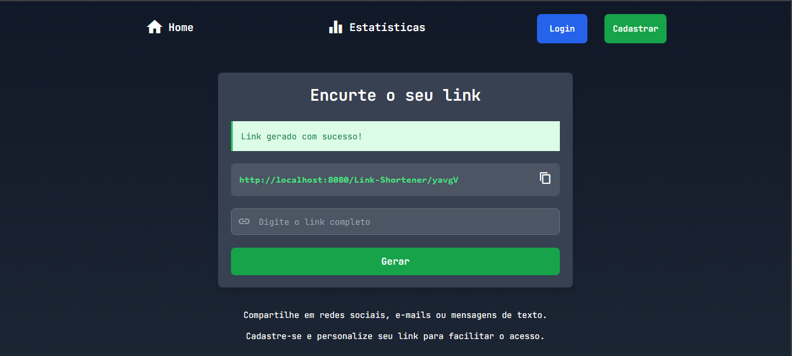
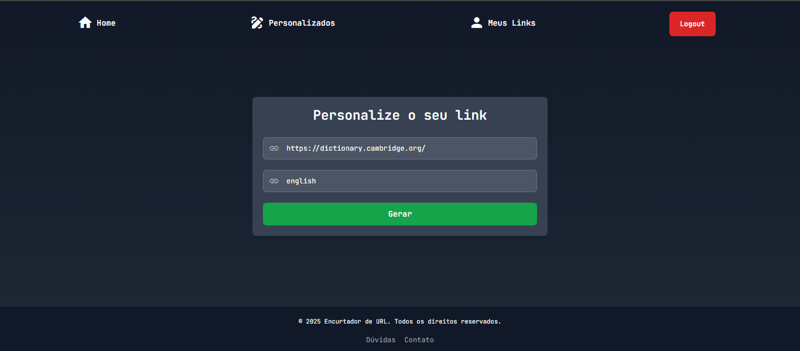
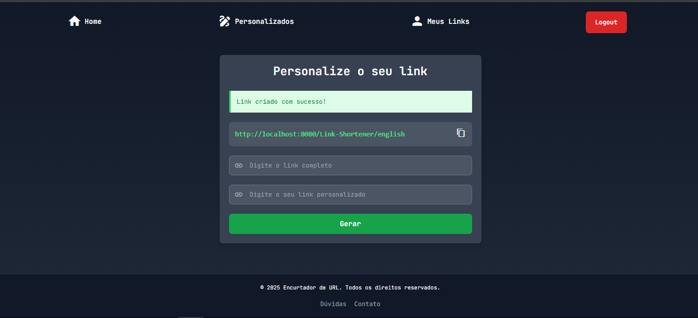
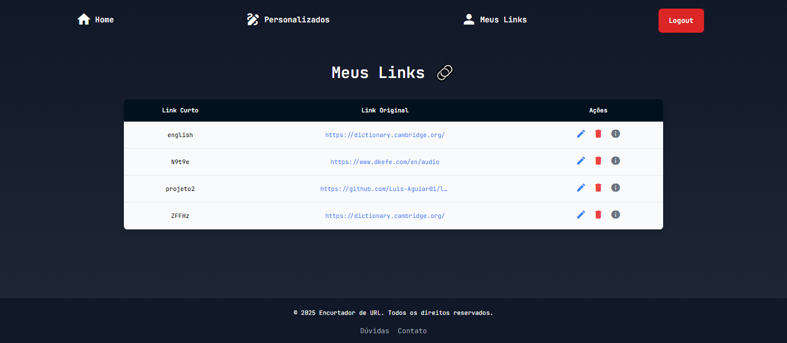
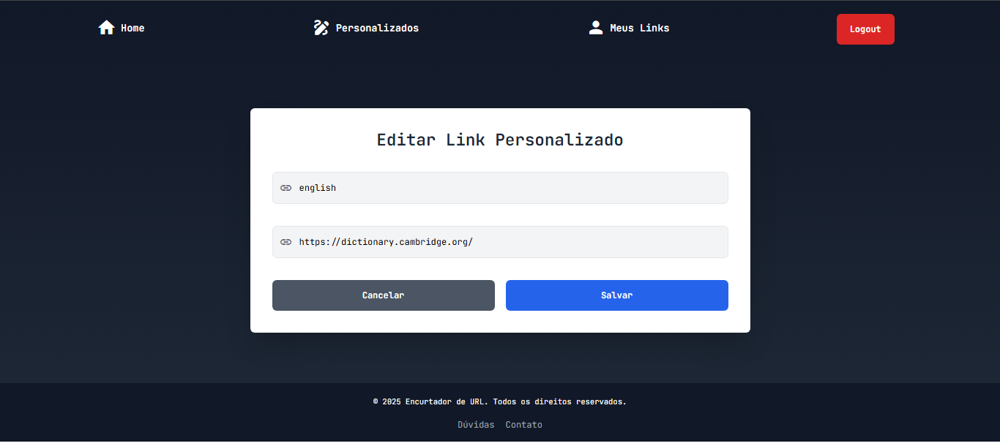
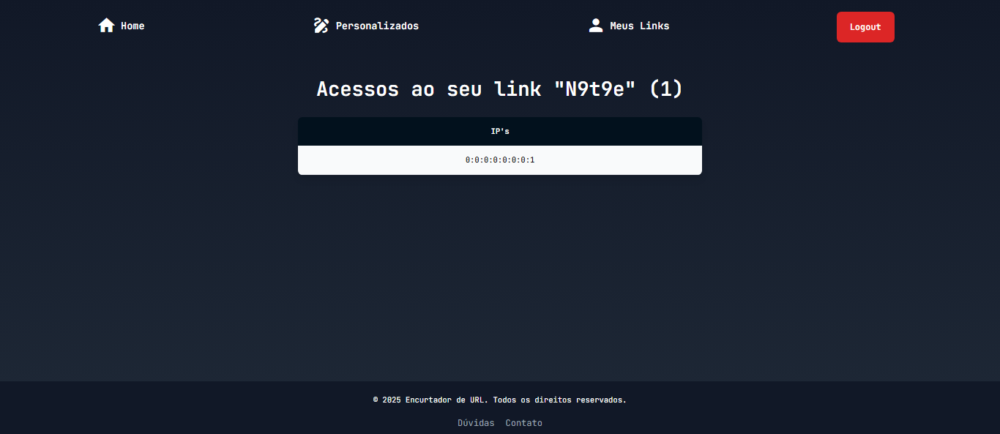
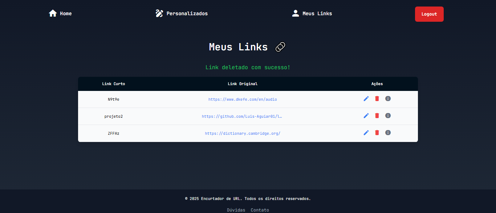

# 🔗 Encurtador de Links  

Este projeto é um encurtador de URLs que permite gerar links curtos e fáceis de memorizar. Nosso aplicativo simplifica o acesso a páginas da web, eliminando a necessidade de lembrar URLs longas e complexas. Dessa forma, proporcionamos uma solução prática e eficiente para melhorar a usabilidade e acessibilidade dos links.  

---

## ✨ Funcionalidades  

### 🔹 Criação de URL curta aleatória  
Usuários não autenticados podem gerar links curtos aleatórios.  

  

### 🔹 Criação de URL curta personalizada  
Usuários autenticados podem criar links curtos personalizados, definindo a URL de redirecionamento.  

  
  

### 🔹 Gerenciamento de links personalizados  
Usuários autenticados podem acessar, editar ou excluir seus links criados. Além disso, podem visualizar estatísticas de acessos, incluindo os IPs que visitaram seus links.  

  
  
  
  

---

## 📌 Especificações do Projeto  

- **💻 IDE:** Eclipse Java EE  
- **☕ Linguagem:** Java 18  
- **🛠️ Servidor de Aplicação:** Apache Tomcat 10.1  
- **🎨 Frontend:** Tailwind CSS via CDN  
- **🗄️ Banco de Dados:** MySQL  
- **📦 Gerenciador de Dependências:** Maven  

---

# 🚀 Instalação do Projeto  

Para rodar o projeto, siga os passos abaixo:  

## 1️⃣ Pré-requisitos  
- Eclipse para Java EE instalado  
- Apache Tomcat 10.1 configurado  

## 2️⃣ Clonando o repositório  
- No Eclipse, vá em:  File > Import > Git > Projects from Git > Clone URI
- Insira a URI do repositório e finalize a importação.  

Caso o processo acima não funcione, você pode clonar o repositório manualmente e abrir no Eclipse:  
- Vá em: File > Open Projects from File System
- Selecione a pasta onde o projeto foi clonado.  

## 3️⃣ Configuração do Dynamic Web Module  
- Acesse: Project > Properties > Project Facets
- Certifique-se de que **Dynamic Web Module 5.0** está ativado.  

Agora o projeto está pronto para execução! 🚀  

---

## 👨‍💻 Desenvolvedores  
| Nome | RA |
|-------|------|
| Luis Henrique Aguiar dos Santos | AQ302234X |
| Érika Santana Alves | AQ3022722 |
| Cristiano Rodrigues de Oliveira | AQ3022641 |
| Matheus Mantovani Gonçalves | AQ3022927 |
